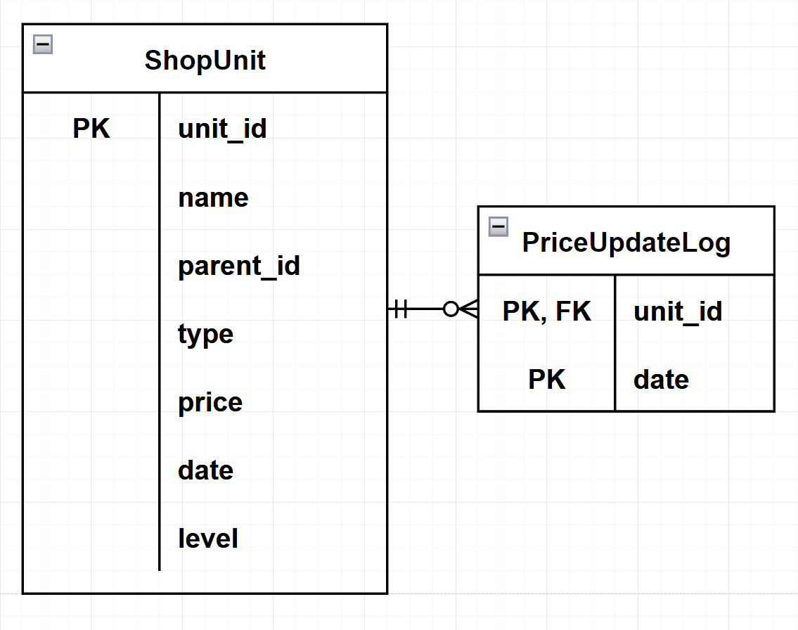

# Market

### REST-API сервис для сервиса сравнения цен

#### Вступительное задание в школу бэкенд-разработки Яндекса

Сервис предоставляет методы:

- `POST /imports` - создает или обновляет категории и товары
- `GET /nodes` - возвращает поддерево выбранной категории или выбранный товар
- `DELETE /delete` - удаляет поддерево или товар
- `GET /sales` - получение обновленных за последние 24 часа товаров

Использованные технологии:

* СУБД Postgres
* ORM sqlalchemy
* Веб-фреймворк Flask
* WSGI-сервер Waitress

Запущенный сервис: https://bali-1898.usr.yandex-academy.ru

Запуск
----------------------
Сервис запускается с использованием Docker Compose. Поднимаются контейнеры с postgres и веб-приложением.

    cd yandex-school-market
    docker-compose build
    docker-compose up

Реализован автозапуск при рестарте, гарантируется персистентность данных.

Тестирование
----------------------
Тесты содержатся в папке `tests`

Схема БД
----------------------

**ShopUnit**  
товары и категории

* unit_id: String, идентификатор юнита
* name: String, название юнита
* parent_id: String, идентификатор родителя
* type: String, CATEGORY (категория) или OFFER (товар)
* price: Integer, цена
* date: DateTime, последняя дата обновления
* level: Integer, уровень в дереве (0, если корень, иначе количество вершин в пути до корня)

**PriceUpdateLog**  
запиши об обновлении товара

* unit_id: String
* date: DateTime, время обновления

Ограничения
----------------------
Сервис работает в предположении, что во входящих данных в `/imports` родители идут перед детьми.

### Комментарий от автора

_Проект интересный, но рекурсивные запросы достаточно сложны. Из-за моей неопытности в них я принял несколько решений,
ускоряющих написание проекта, но приводящих к некоторым ограничениям сервиса. Очень хотел бы во всем этом разобраться
поподробнее, но во время сессии времени очень мало_ :-(
